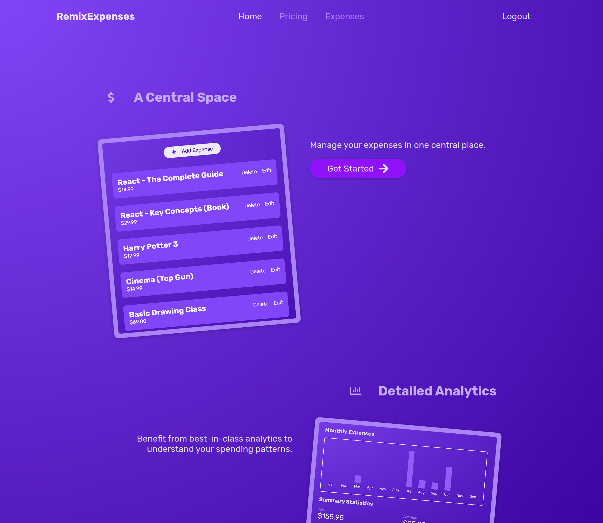

# RemixJS - The Practical Guide - Udemy Course

## Course Info & Resources

- [Course Link](https://www.udemy.com/course/remix-course/) | [Certificate of Completion](https://www.udemy.com/certificate/UC-2c6b8e30-b038-40f8-bff2-fd54ed461c17/)
- [Remix Docs](https://remix.run/docs)

## The Course & Project

<!-- Insert pic from /public/images/remixexpenses_home.png -->


- Following the Udemy Course and built an Expense Tracker app to learn how use RemixJS to build a full-stack web app.
- The app is a simple expense tracker that allows users to add, edit, and delete expenses.
  - Routing, Private Routes, Authentication, Session Cookies
  - CRUD Operations
  - Data Persistence using MongoDB Atlas with Prisma.io
  - Optimization and Deployment

## Development

From your terminal:

```sh
npm run dev
```

This starts your app in development mode, rebuilding assets on file changes.

## Deployment

Make sure to run `npx prisma generate` before deploying.

First, build your app for production:

```sh
npm run build
```

Then run the app in production mode:

```sh
npm start
```
